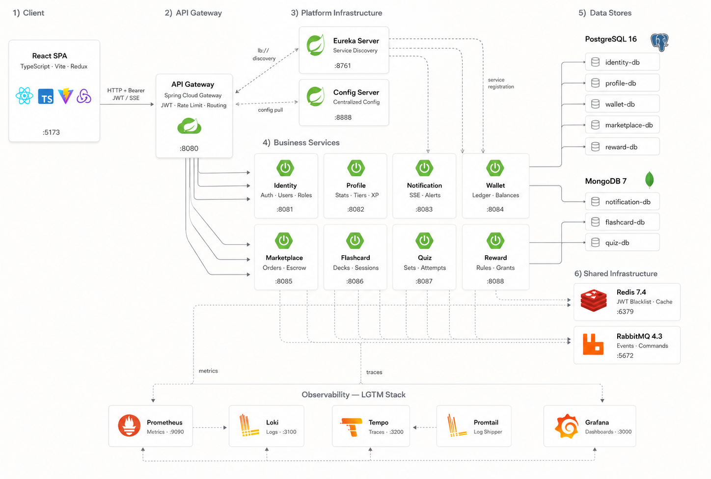
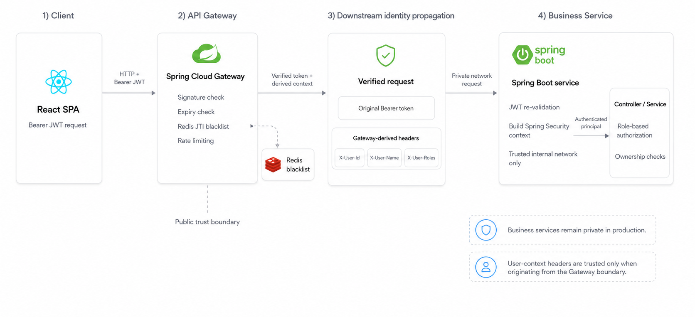

<div align="center">

<!-- prettier-ignore -->
<pre style="background: transparent; border: none; padding: 0;">
  █████████  ██████████ █████ █████   ████   █████████  
 ███▒▒▒▒▒███▒▒███▒▒▒▒▒█▒▒███ ▒▒███   ███▒   ███▒▒▒▒▒███ 
▒███    ▒▒▒  ▒███  █ ▒  ▒███  ▒███  ███    ▒███    ▒███ 
▒▒█████████  ▒██████    ▒███  ▒███████     ▒███████████ 
 ▒▒▒▒▒▒▒▒███ ▒███▒▒█    ▒███  ▒███▒▒███    ▒███▒▒▒▒▒███ 
 ███    ▒███ ▒███ ▒   █ ▒███  ▒███ ▒▒███   ▒███    ▒███ 
▒▒█████████  ██████████ █████ █████ ▒▒████ █████   █████
 ▒▒▒▒▒▒▒▒▒  ▒▒▒▒▒▒▒▒▒▒ ▒▒▒▒▒ ▒▒▒▒▒   ▒▒▒▒ ▒▒▒▒▒   ▒▒▒▒▒
</pre>

### An e-learning and digital-content platform

Seika brings learning, content creation, a creator marketplace, virtual currency,
rewards, and real-time notifications together in an event-driven microservices system.

[](LICENSE)


[Overview](#project-overview) ·
[Features](#key-features) ·
[Architecture](#microservices-architecture) ·
[Security](#security-architecture) ·
[Reliability](#reliability-and-distributed-consistency) ·
[Run locally](#running-seika-locally)

</div>

---

## Project Overview

Seika is designed for three groups: students who want engaging study tools,
teachers who create and monetize educational content, and administrators who
operate the platform safely. Students can study flashcards and quizzes, purchase
teacher-created material, earn rewards, and track their progress. Teachers can
publish content and build a sustainable income stream, while administrators
manage users, moderation, the platform economy, escrow cases, and marketplace risk.

Microservices fit this domain because identity, learning content, commerce,
financial ledgers, rewards, and notifications have different data models, scaling
patterns, and consistency requirements. Separating them into bounded contexts
keeps financial rules isolated, supports asynchronous workflows, and allows each
capability to evolve without sharing a database or deployment unit.

## Key Features

### Students

- Study flashcard sets and take polymorphic quizzes, including multiple-choice,
  reorder, matching, and fill-in-the-blank questions.
- Track study sessions, attempts, progress, experience, and reward history.
- Discover and purchase teacher-created content through the marketplace.
- Manage paid, bonus, and reward coin balances with a traceable wallet ledger.
- Receive persistent and real-time notifications through an authenticated SSE stream.

### Teachers

- Create and maintain flashcard and quiz content.
- Publish content into a moderated marketplace catalog.
- Review sales, reach, ratings, tier progress, and earnings statistics.
- Earn tier-based marketplace revenue through held escrow and controlled release.
- Request withdrawals from eligible teacher-withdrawable funds.

### Administrators

- Manage users, roles, account state, and platform-level statistics.
- Moderate marketplace products and manage economy configuration.
- Inspect revenue, wallets, transaction history, and teacher payouts.
- Review escrow disputes, refunds, partial refunds, and exceptional payment states.
- Investigate collusion flags and apply risk controls to suspicious funds.

## Microservices Architecture

### Overview

Seika uses a Java 21 and Spring Boot 4 backend with eight business services behind
Spring Cloud Gateway. Services discover one another through Eureka and load
centralized runtime configuration from Spring Cloud Config. Synchronous REST and
OpenFeign calls serve request-response use cases; RabbitMQ carries integration
events and wallet commands for cross-service workflows. Each service owns its
storage, while Redis provides JWT revocation, distributed rate-limit state, and
read caching. The React SPA is deployed separately and sends all public API traffic
through the Gateway.

### System Architecture

<p align="center">
  
</p>

### Microservices Catalog

| Service                          | Responsibility                                                                                                              | Storage            | Communication                                                                 |
| -------------------------------- | --------------------------------------------------------------------------------------------------------------------------- | ------------------ | ----------------------------------------------------------------------------- |
| **API Gateway** `:8080`          | Public entry point, routing, JWT validation, revocation checks, user-context headers, rate limiting, and aggregated OpenAPI | Redis              | HTTP/WebFlux to clients; service discovery and load-balanced REST to services |
| **Config Server** `:8888`        | Centralized base and environment-specific configuration                                                                     | Classpath YAML     | Spring Cloud Config over HTTP                                                 |
| **Eureka Server** `:8761`        | Service registration and discovery                                                                                          | In-memory registry | Eureka protocol over HTTP                                                     |
| **Identity Service** `:8081`     | Users, roles, credentials, access/refresh tokens, logout, and admin user controls                                           | PostgreSQL, Redis  | REST/OpenFeign; publishes identity events through RabbitMQ                    |
| **Profile Service** `:8082`      | User, game, and teacher profile projections, statistics, tiers, experience, and reach                                       | PostgreSQL, Redis  | REST; consumes identity, content, marketplace, and reward events              |
| **Notification Service** `:8083` | Persistent notifications and per-user real-time delivery                                                                    | MongoDB            | REST and authenticated SSE; consumes RabbitMQ events                          |
| **Wallet Service** `:8084`       | Multi-bucket balances, financial ledger, holds, freezes, cash flows, and idempotent money commands                          | PostgreSQL         | REST; consumes wallet commands and publishes result events through RabbitMQ   |
| **Marketplace Service** `:8085`  | Catalog, moderation, orders, inventory, reviews, ratings, escrow, refunds, and collusion controls                           | PostgreSQL, Redis  | REST; RabbitMQ commands and integration events                                |
| **Flashcard Service** `:8086`    | Flashcard sets, cards, study sessions, ownership projection, and deck-completion events                                     | MongoDB, Redis     | REST/OpenFeign; publishes and consumes RabbitMQ events                        |
| **Quiz Service** `:8087`         | Quiz sets, polymorphic questions, attempts, statistics, and completion events                                               | MongoDB, Redis     | REST/OpenFeign; publishes and consumes RabbitMQ events                        |
| **Reward Service** `:8088`       | Reward rules, cooldowns, learning reward log, and reward grants                                                             | PostgreSQL         | REST; consumes learning events and publishes reward events through RabbitMQ   |

## Security Architecture

Seika uses the API Gateway as its public trust boundary and applies defense in
depth inside the business services.

| Layer                      | Implemented control                                                                                                                                                                                          |
| -------------------------- | ------------------------------------------------------------------------------------------------------------------------------------------------------------------------------------------------------------ |
| **Credentials**            | Passwords are hashed with BCrypt by the Identity Service. Credentials and roles remain inside the Identity database.                                                                                         |
| **Token issuance**         | Identity issues signed HS256 access tokens containing `jti`, issuer, username subject, `userId`, and roles. Refresh tokens are persisted in PostgreSQL and can be revoked.                                   |
| **Gateway authentication** | The Gateway verifies JWT signature, structure, and expiry before routing protected requests. Public paths are explicitly configured.                                                                         |
| **Logout and revocation**  | Logout stores `auth:blacklist::{jti}` in Redis until the access token expires. The Gateway rejects blacklisted tokens.                                                                                       |
| **Downstream identity**    | The Gateway preserves the Bearer token and derives `X-User-Name`, `X-User-Id`, and `X-User-Roles` from verified claims. Servlet services validate the JWT again and build their own Spring Security context. |
| **Authorization**          | Endpoint and method-level rules enforce role-based access with `STUDENT`, `TEACHER`, and `ADMIN` authorities.                                                                                                |
| **Edge protection**        | CORS allowlists are configurable, auth routes use IP-based throttling, and authenticated routes use per-user rate limiting with an IP fallback.                                                              |

<p align="center">
  
</p>

Business services should remain private in production. Directly exposing them
would bypass the Gateway's centralized revocation check, and user-context headers
must only be trusted when they originate from that controlled network boundary.

## Reliability and Distributed Consistency

The marketplace and wallet flow is designed around local ACID transactions and
retry-safe messages instead of a cross-service database transaction.

### Purchase and escrow workflow

1. Marketplace validates canonical product data and atomically stores a
   `PENDING_PAYMENT` order with a `wallet.debit.requested` outbox record.
2. Wallet consumes the command, acquires a wallet lock, applies an idempotent
   multi-bucket debit, records ledger entries, and stores the result in its own outbox.
3. Marketplace deduplicates the wallet result through its inbox. A successful
   result marks the order paid, grants inventory, creates held per-item escrows,
   and publishes `content.purchased`.
4. Scheduled escrow release, full refund, and partial refund operations emit
   stable credit/refund commands. Result events advance the escrow state or move
   exceptional failures into an administrator-review state.

This is a **choreographed Saga-style workflow**: Marketplace owns the business
state machine, while Marketplace and Wallet exchange commands and results. It
does not depend on a separate Saga orchestration framework.

### Implemented resilience mechanisms

| Mechanism                            | How Seika uses it                                                                                                                                                                                   |
| ------------------------------------ | --------------------------------------------------------------------------------------------------------------------------------------------------------------------------------------------------- |
| **Database per service**             | A service owns its schema or database; cross-service joins are replaced with APIs, events, and local projections.                                                                                   |
| **Transactional Outbox**             | Marketplace, Wallet, and Reward persist business state and outgoing events together before scheduled publication.                                                                                   |
| **Transactional Inbox**              | Marketplace records processed Wallet result messages and skips redelivery by stable message identity.                                                                                               |
| **Idempotency**                      | Order request keys, event IDs, correlation IDs, escrow command keys, and wallet idempotency records make retries safe.                                                                              |
| **Concurrency control**              | Wallet mutations and escrow transitions use pessimistic/advisory locks; outbox workers claim bounded batches with row locking.                                                                      |
| **Retries and dead-letter handling** | Marketplace and Wallet outboxes retry with bounded exponential backoff. Exhausted Wallet events are routed to a DLQ; Marketplace marks exhausted records dead for inspection.                       |
| **Circuit breakers**                 | Resilience4j protects OpenFeign calls in Identity, Flashcard, and Quiz. Calls use 3-second connect and 5-second read limits, with fallbacks chosen by business criticality.                         |
| **Rate limiting**                    | Redis-backed token buckets protect every Gateway route: auth traffic uses 10 requests/second with a burst of 20 per IP; general traffic uses 50 requests/second with a burst of 100 per user or IP. |
| **Escrow and compensation**          | Teacher earnings remain held until release conditions pass. Refund commands and review states provide explicit compensating paths.                                                                  |
| **Cache consistency**                | Read models are cached in Redis, while writes and consumed projection events update or evict affected entries.                                                                                      |

## Observability

The backend ships a separate LGTM observability stack. Spring Boot Actuator and
Micrometer expose service metrics to Prometheus; Promtail forwards container logs
to Loki; OpenTelemetry exports distributed traces over OTLP to Tempo. Grafana is
provisioned with all three data sources and a Spring Boot metrics dashboard, so
operators can move from a metric spike to related logs and trace waterfalls.

| Signal  | Pipeline                                                 |
| ------- | -------------------------------------------------------- |
| Metrics | Spring Boot Actuator → Micrometer → Prometheus → Grafana |
| Logs    | Docker container logs → Promtail → Loki → Grafana        |
| Traces  | Micrometer/OpenTelemetry → OTLP → Tempo → Grafana        |

Start the stack independently from the application:

```powershell
docker compose -f docker-compose.observability.yml up -d
```

## Testing

### Performance and load testing

[`scripts/load-test.js`](scripts/load-test.js) uses Grafana k6 to execute three
concurrent scenarios:

- A ramping user flow from 0 to 50 virtual users for login and flashcard browsing.
- A 50 requests/second auth burst that verifies HTTP `429` rate limiting.
- A five-user circuit-breaker probe that checks Gateway and downstream responsiveness.

The suite enforces p95 below 1 second, p99 below 2 seconds, and a custom system
error rate below 10%. Run it with local k6:

```powershell
k6 run scripts\load-test.js
```

Or run it without installing k6:

```powershell
Get-Content scripts\load-test.js | docker run --rm -i `
  -e BASE_URL="http://host.docker.internal:8080" `
  grafana/k6 run -
```

### Chaos testing

[`scripts/chaos-test.ps1`](scripts/chaos-test.ps1) starts the k6 workload, warms
the system, pauses the Wallet container, observes circuit-breaker behavior, then
unpauses the service and checks recovery:

```powershell
.\scripts\chaos-test.ps1
```

Do not run this fault-injection script against a shared or production environment.

The recorded local baseline from 25 July 2026 is documented in the
[load and chaos test report](docs/testing/LOAD_AND_CHAOS_TEST_REPORT.md):

| Measurement                               |            Recorded result |
| ----------------------------------------- | -------------------------: |
| HTTP requests                             |                      3,979 |
| Checks passed                             |              6,457 / 6,457 |
| Overall latency                           | p95 21.14 ms; p99 68.43 ms |
| Custom system error rate                  |                      0.00% |
| Auth requests rate-limited                |     1,183 / 1,501 (78.81%) |
| Circuit-breaker probe during Wallet pause |         100% checks passed |

These figures describe one controlled portfolio test run, not a production SLA.

## Running Seika Locally

### Prerequisites

- Docker Desktop with Docker Compose v2
- Node.js and npm for the React frontend
- At least 8 GB of available memory is recommended for the full local stack

### 1. Configure the environment

From the repository root, create the local environment file:

```powershell
Copy-Item .env.example .env
```

On macOS or Linux:

```bash
cp .env.example .env
```

Review `.env` before starting the stack. The example values are intended for
local development; replace passwords, the initial administrator credentials, and
the JWT secret for any shared or deployed environment. Never commit `.env`.

### 2. Start the backend and infrastructure

```powershell
docker compose up -d --build
docker compose ps
```

This starts RabbitMQ, Redis, PostgreSQL databases, the MongoDB replica set,
Eureka, Config Server, the eight business services, and the API Gateway.

### 3. Start the frontend

The React SPA is intentionally not included in the backend Compose stack:

```powershell
npm --prefix src/web-app install --legacy-peer-deps
npm --prefix src/web-app run dev
```

Open `http://localhost:5173`. The frontend uses
`http://localhost:8080/api` as its default API base URL.

### 4. Useful local endpoints

| Endpoint                 | URL                                     |
| ------------------------ | --------------------------------------- |
| React application        | <http://localhost:5173>                 |
| API Gateway              | <http://localhost:8080>                 |
| Aggregated Swagger UI    | <http://localhost:8080/swagger-ui.html> |
| Eureka dashboard         | <http://localhost:8761>                 |
| Config Server            | <http://localhost:8888>                 |
| RabbitMQ Management      | <http://localhost:15672>                |
| Grafana, when enabled    | <http://localhost:3000>                 |
| Prometheus, when enabled | <http://localhost:9090>                 |

### 5. Verify and stop

```powershell
# Backend logs
docker compose logs -f api-gateway

# Frontend quality gates
npm --prefix src/web-app run lint
npm --prefix src/web-app run typecheck
npm --prefix src/web-app run build

# Stop the application stack while preserving named volumes
docker compose down

# Stop the optional observability stack
docker compose -f docker-compose.observability.yml down
```

For a clean database reset, use the project runbook rather than deleting volumes
ad hoc: [Database reset runbook](docs/runbooks/db-reset-v3.md).

## Contributors

| Name              | GitHub                                                   |
| ----------------- | -------------------------------------------------------- |
| Nguyễn Hùng Cường | [@NguyenHungCuongg](https://github.com/NguyenHungCuongg) |
| Hồ Minh Đạt       | [@senkochi](https://github.com/senkochi)                 |

## License

Seika is released under the [MIT License](LICENSE).
